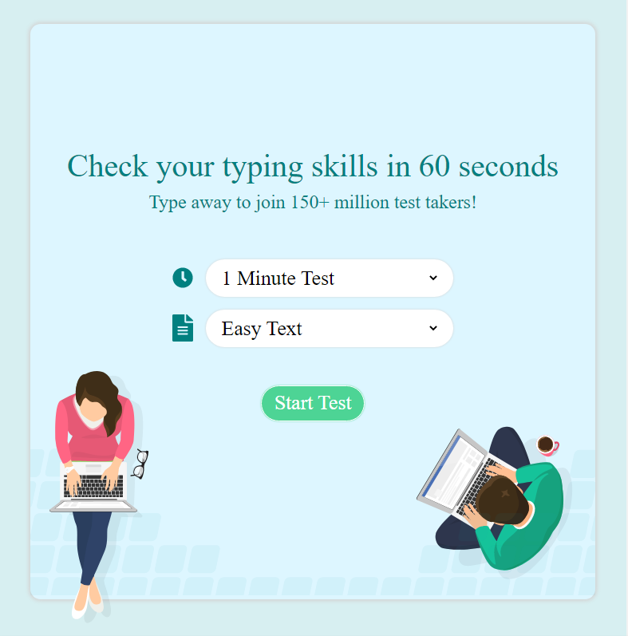
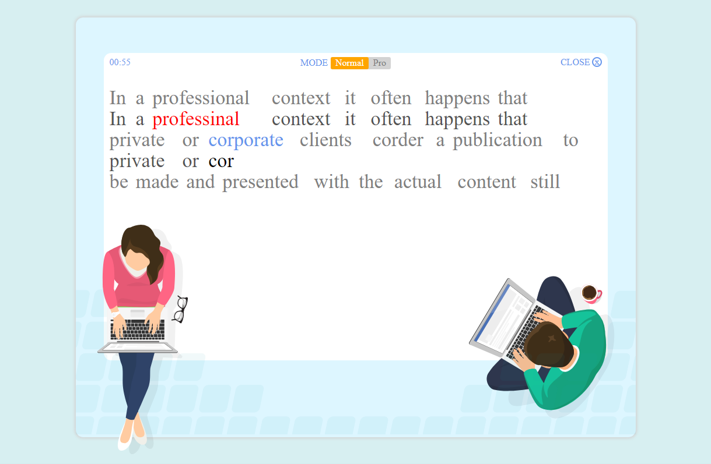
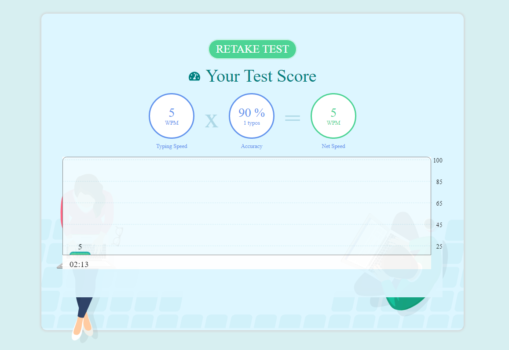

# azkatech-typing-app

## bringing old projects to life/ A project from Dec 26, 2021

This project was done for azkatech, it is a typing test project..

In this project I use the jquery as a framework for javascript to give the functionality to the app.
The app consist of three pages:

### Main page:
where you can setup the test options as shown below

### Typing page:
where you can start by typing below the sentences already their

### Results page:
this page will show you the different between the previous level and the current level of your typing skill.

